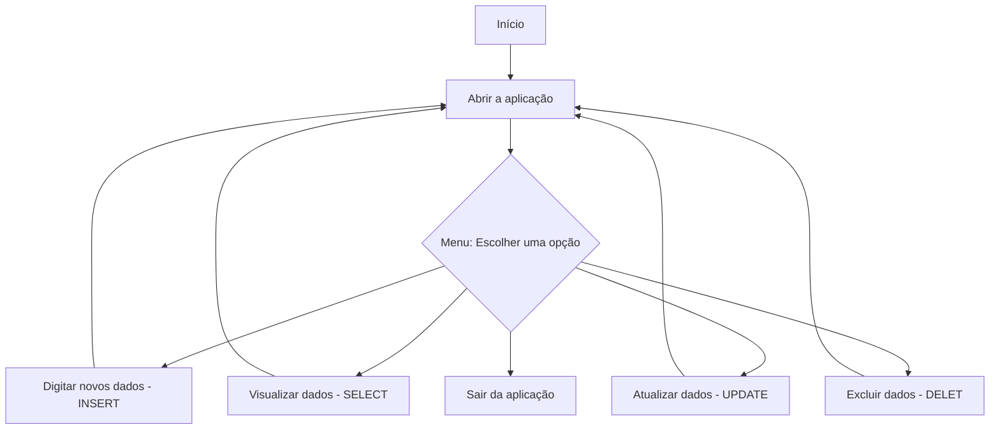

## Calculadora Idade 
Projeto feito durante a aula do _@GustavoGuanabara_ no CursoEmVideo de Java.   
Ele tem por objetivo compreender mais sobre entrada e saída de dados numa interface simples, bem como criação e organização de interfaces interativas.

A proposta principal é criar uma **Calculadora de Idade**, o usuário ao abrir a aplicação, deve digitar a sua data de 
nascimento, então a aplicação o dirá quantos anos ele tem.  
Essa aplicação pode funcionar acoplada a outros códigos mais complexos, onde você poderá através de apenas um dado digitado
pelo usuário, no banco de dados você poderá ter 2 dados diferentes, o de idade e o da data de nascimento deste.

Acompanhe um fluxograma da projeção final deste:

# Tarefas:
- [x] O usuário colocou um ano e o código fez o cálculo 2025-ano de nascimento digitado.
- [x] O usuário digita seu ano de nascimento e a aplicação o retorna  a idade puxando a data da máquina deste.
- [ ] O usuário digita sua data de nascimento e a aplicação retorna a idade puxando a data da máquina deste.
- [ ] O usuário digita sua data de nascimento e a aplicação armazena tanto a data de nascimento dele, bem como a idade, 
em um banco de dados SQLite.
- [ ] O usuário abre a aplicação e pode escolher entre ver uma planilha com os dados do banco ou digitar novos dados.
- [ ] O usuário abre a aplicação e pode escolher: ver a planilha com os dados do banco, digitar novos dados ou atualizar os dados.
- [ ] Então, o usuário abre um menu que pode escolher entre ver a planilha com os dados do banco, digitar novos dados, atualizar dados ou excluir já antes dados.

>"Falhe, desde que não desista, não estará falhando."

**Projetado com:**

## 📥 Baixar o Executável
[✨Clique aqui para baixar o .jar✨](https://github.com/ifLauraAlmeida/CalculadoraIdade/tree/main/dist)
